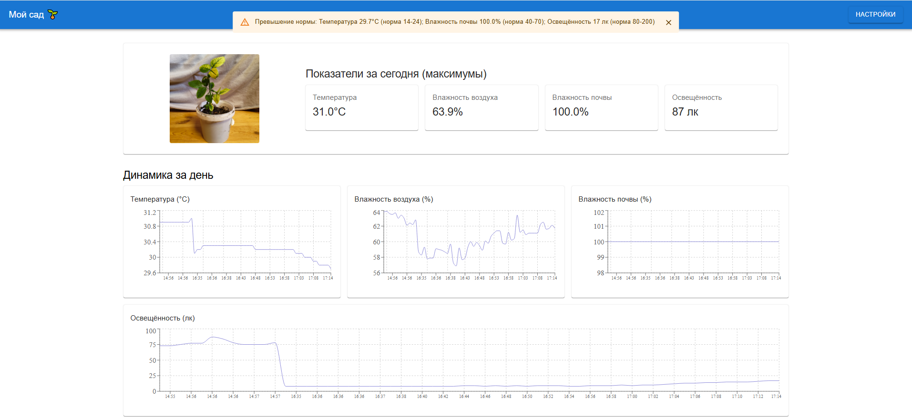
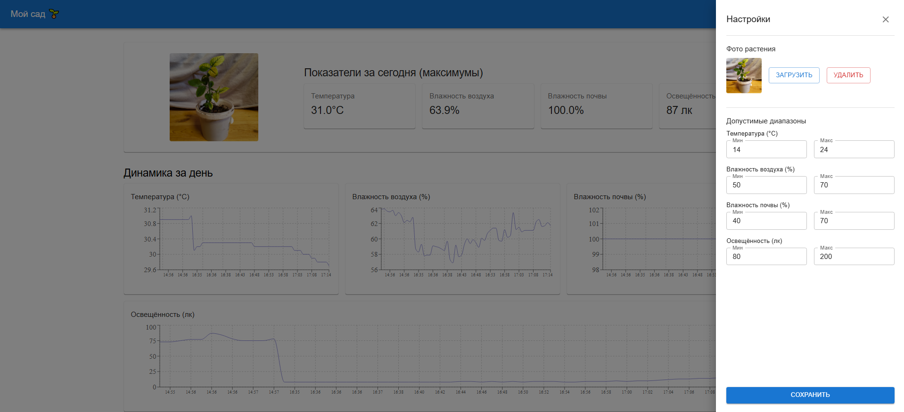
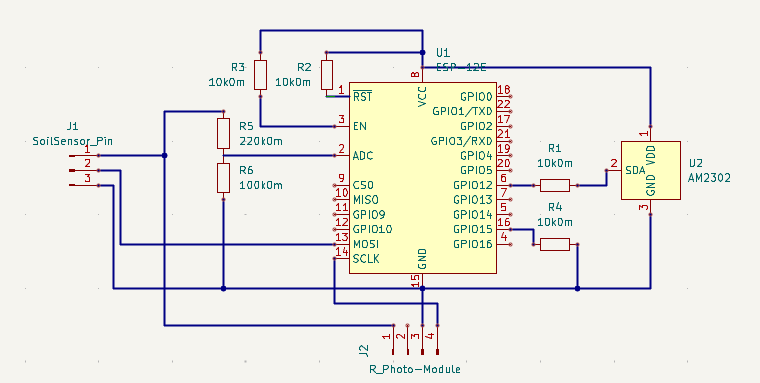
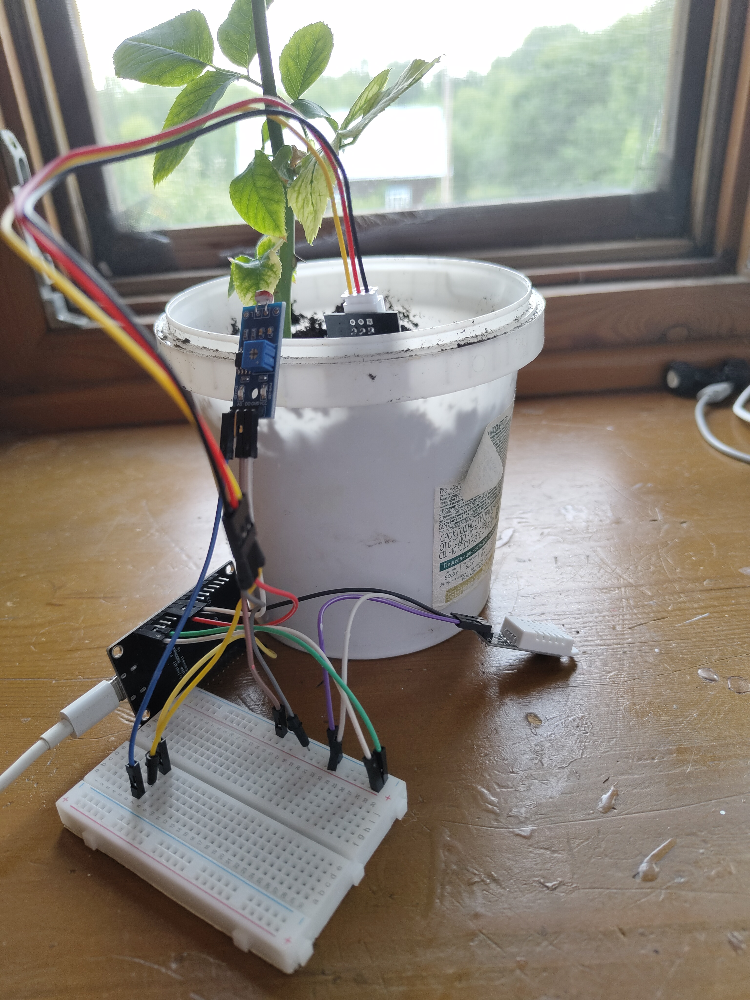

# Обзор проекта «Plant‑care‑device»

## Введение

Данный проект представляет собой систему мониторинга состояния растений на основе микроконтроллера ESP‑12E, серверной части на Node.js и веб‑клиента на React. Устройство измеряет температуру, влажность воздуха, влажность почвы и освещённость, отправляет данные на сервер, где они сохраняются в SQLite и отображаются на интерактивных графиках. Пользователь может задавать пороговые значения для каждого параметра и получать оповещения при их выходе за норму.

В обзоре представлены ключевые фотографии, демонстрирующие работу системы: внешний вид интерфейса, электрическая схема подключения датчиков и собранное устройство.

---

## 1. Интерфейс клиента – главный экран

На первом скриншоте показана главная страница веб‑приложения. В верхней части расположены карточки с максимальными значениями параметров за сегодняшний день: температура, влажность воздуха, влажность почвы и освещённость. Под карточками находится график динамики выбранного параметра за последние 24 часа – он построен с использованием библиотеки recharts. Справа или снизу (в зависимости от разрешения) расположена панель с фотографией растения (загружается пользователем) и кнопками для настройки порогов.

Интерфейс адаптивен, выполнен в светлой минималистичной цветовой гамме, что облегчает восприятие данных.

---

## 2. Интерфейс клиента – настройка порогов и оповещения

Второй скриншот демонстрирует окно настройки допустимых диапазонов для каждого измеряемого параметра. Пользователь может задать минимальное и максимальное значение, а также включить или отключить отправку уведомлений. При выходе фактического значения за установленные границы в правом нижнем углу появляется всплывающее окно (Snackbar) с предупреждением. Также на этом экране отображается последнее полученное измерение в реальном времени, что позволяет быстро оценить текущую ситуацию.

Настройки сохраняются в локальном хранилище браузера (localStorage), поэтому они не сбрасываются после перезагрузки страницы.

---

## 3. Электрическая схема подключения датчиков

На схеме показано подключение всех компонентов к плате ESP‑12E (NodeMCU). Центральным элементом является микроконтроллер ESP8266. К его цифровым и аналоговым пинам подключаются:

- **DHT22** – сигнальный провод на GPIO12 (D6), питание 3,3 В, земля.
- **Емкостной датчик влажности почвы** – питание управляется через транзисторный ключ от GPIO13 (D7), сигнальный выход подключён к аналоговому входу A0.
- **Фоторезистор (освещённость)** – питание также управляется от GPIO14 (D5), сигнал – на тот же A0 (поочерёдное включение датчиков исключает конфликт на линии).

Питание всех датчиков организовано от стабилизатора 3,3 В встроенного в плату. На схеме также отмечены подтягивающие резисторы (для DHT22 и фоторезистора) и разъём USB для программирования и питания от компьютера или внешнего блока питания 5 В.

---

## 4. Готовое устройство в сборе

На фотографии представлено устройство на макетной плате (корпус будет разработан позднее).

 Устройство питается от USB‑адаптера (5 В, 1 А) через кабель micro‑USB, встроенный в корпус. Светодиод на плате индицирует состояние Wi‑Fi и отправку данных – это упрощает визуальную диагностику.

---

## Заключение

В дальнейшем планируется добавление удалённого доступа через интернет, интеграция с Telegram‑ботом и поддержка нескольких устройств одновременно.